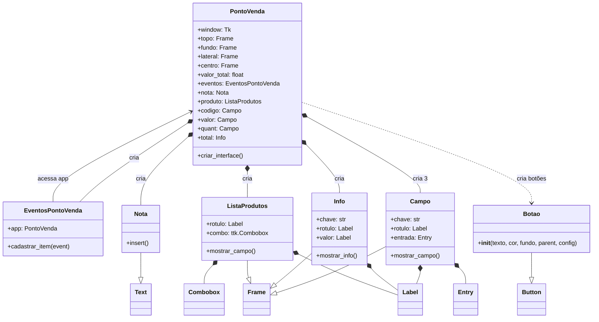

# Diagrama de Classes

O diagrama abaixo representa as principais classes do projeto e seus relacionamentos.

```mermaid
classDiagram
    class PontoVenda {
        +window: Tk
        +topo: Frame
        +fundo: Frame
        +lateral: Frame
        +centro: Frame
        +valor_total: float
        +eventos: EventosPontoVenda
        +nota: Nota
        +produto: ListaProdutos
        +codigo: Campo
        +valor: Campo
        +quant: Campo
        +total: Info
        +criar_interface()
    }

    class EventosPontoVenda {
        +app: PontoVenda
        +cadastrar_item(event)
    }

    class Botao {
        +__init__(texto, cor, fundo, parent, config)
    }

    class Campo {
        +chave: str
        +rotulo: Label
        +entrada: Entry
        +mostrar_campo()
    }

    class Info {
        +chave: str
        +rotulo: Label
        +valor: Label
        +mostrar_info()
    }

    class ListaProdutos {
        +rotulo: Label
        +combo: ttk.Combobox
        +mostrar_campo()
    }

    class Nota {
        +insert()
    }

    class Frame
    class Button
    class Text
    class Label
    class Entry
    class Combobox

    Botao --|> Button
    Campo --|> Frame
    Info --|> Frame
    ListaProdutos --|> Frame
    Nota --|> Text

    PontoVenda *-- EventosPontoVenda : cria
    PontoVenda *-- Nota : cria
    PontoVenda *-- ListaProdutos : cria
    PontoVenda *-- Campo : cria 3
    PontoVenda *-- Info : cria
    PontoVenda ..> Botao : cria botões

    EventosPontoVenda --> PontoVenda : acessa app
    Campo *-- Label
    Campo *-- Entry
    Info *-- Label
    ListaProdutos *-- Label
    ListaProdutos *-- Combobox
```